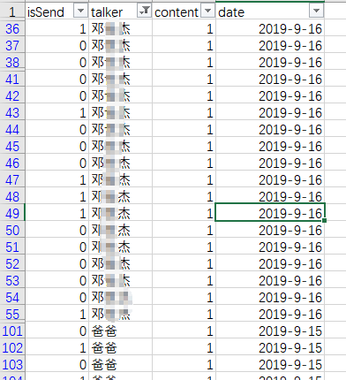
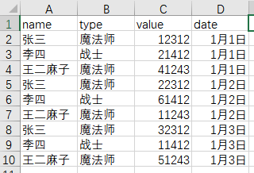
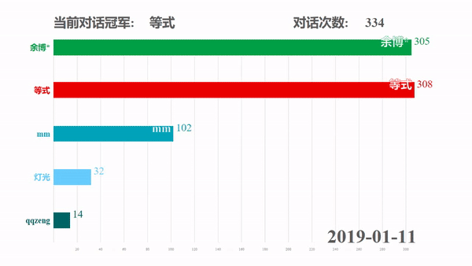

## 获取微信聊天记录

### IOS版
利用itunes备份聊天记录，比较简单，可以网上搜一下。

### 安卓版

#### 已经root的手机
参考：  
https://github.com/contr4l/MicromsgHistory

#### 没有root的手机
1. 把聊天记录备份到windows版微信上面。
2. 安装已经root的手机虚拟机（我用的是夜神模拟器）
3. 在手机虚拟机上面登陆微信，并恢复聊天记录。
4. 按照已经root的手机的方法继续：https://github.com/contr4l/MicromsgHistory

把db文件中的message导出成csv格式，并且整理成4个字段isSend，talker，content，date：

date是通过createTime(unix时间)来转换的。  
聊天内容content直接设为1，这是因为我们只需要统计对话的次数。  
talker需要根据聊天内容手动设置。

## 把聊天数据导入mysql

1. 创建表
CREATE TABLE messages (  
  isSend int(11) DEFAULT NULL,  
  talker varchar(45) DEFAULT NULL,  
  content varchar(10) DEFAULT NULL,  
  date varchar(45) DEFAULT NULL  
) ENGINE=InnoDB DEFAULT CHARSET=utf8  

2. 把聊天数据导入数据库  
LOAD DATA INFILE 'E:\\Desktop\\viewTalkChange\\simplified.csv' INTO TABLE messages  
CHARACTER SET GBK  
FIELDS TERMINATED BY ','  
LINES TERMINATED BY '\r\n'  
IGNORE 1 LINES  
(isSend,talker,content,date);  

## 获取显示所需格式的数据

动态数据的展示是通过这位大佬的JavaScript项目：  
https://github.com/Jannchie/Historical-ranking-data-visualization-based-on-d3.js

我们需要把数据转换成这种形式：  

我写了一个go语言的程序来将mysql中的数据 转换成 这种格式的数据：
[main.go](./main.go)

## 输出动态变化的趋势图

动态数据的展示是通过这位大佬的JavaScript项目：  
https://github.com/Jannchie/Historical-ranking-data-visualization-based-on-d3.js

为了更好地展示，我修改了里面的部分内容：[HistoricalVisual](./HistoricalVisual)

打开bargraph.html并选择数据(gooutput1.csv)，就能输出结果：  

